# practicas_appsweb
En este repositorio encontrarás alguna pequeñas prácticas relacionadas con el diseño de aplicaciones web en lenguaje HTML, CSS, y JS. A continuación, una breve descripción de cada uno de ellos:
 
### Acomodar Bloques:
Este archivo HTML demuestra el uso de Flexbox en CSS para la disposición de elementos dentro de contenedores flexibles, con diferentes configuraciones de dirección, alineación y distribución de espacio.

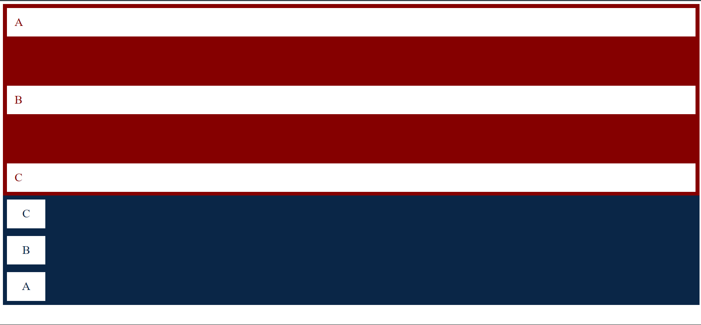

### Cafebrería:
Este archivo HTML crea una página web para una "Cafebrería", combinando una librería y una cafetería. Utiliza Bootstrap para el estilo y la estructura de la página, incluyendo un menú de navegación, un carrusel de imágenes, secciones de contenido con texto e imágenes, y tarjetas de libros recomendados. También incluye un modal que se activa con botones en el menú de navegación. La página está diseñada para ser responsiva y estéticamente agradable, integrando fuentes personalizadas y hojas de estilo CSS externas.

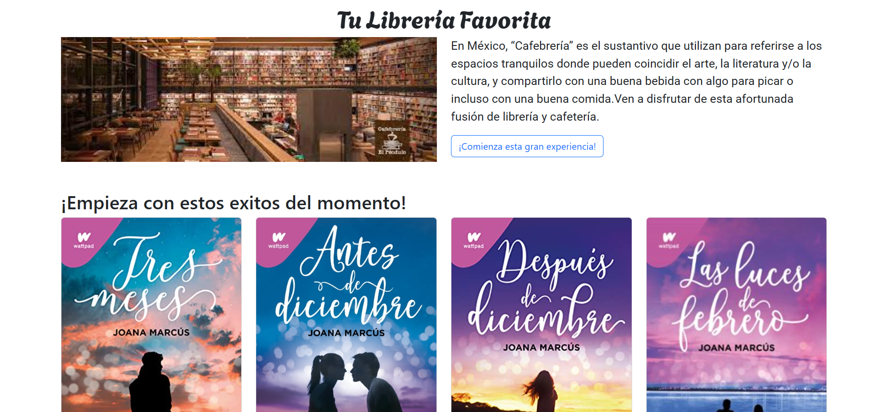

### Cambiar Tamaño:
Este archivo HTML ilustra el uso de media queries en CSS para cambiar dinámicamente el diseño y los estilos de la página en función del tamaño de la pantalla del navegador.

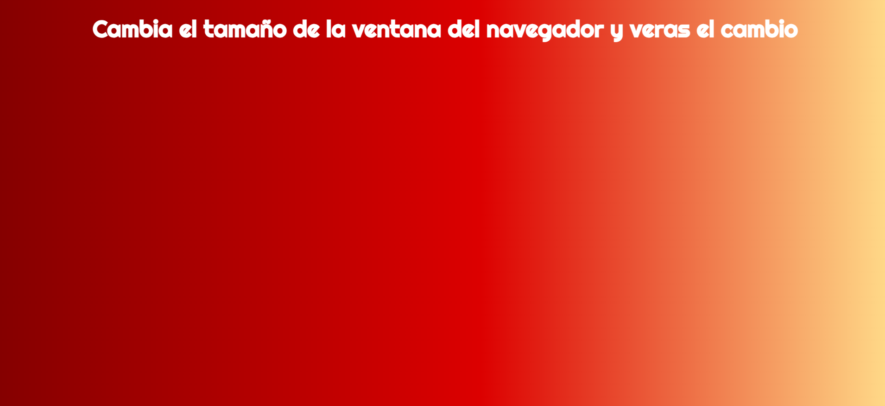

### Ciudades:
Este archivo HTML muestra cómo utilizar múltiples fuentes personalizadas de Google Fonts y aplicar estilos CSS a diferentes elementos de la página, como el cuerpo, encabezados y enlaces, para crear una lista de ciudades que se desean visitar.

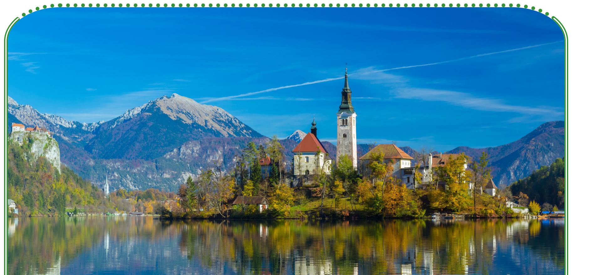

### Colores:
Este archivo HTML demuestra el uso de Bootstrap 5 para crear una página web con un diseño responsivo, incluyendo contenedores fluidos, un carrusel de imágenes, y diversas clases de utilidad de Bootstrap para gestionar el espaciado, el alineamiento de texto, y el diseño de columnas.

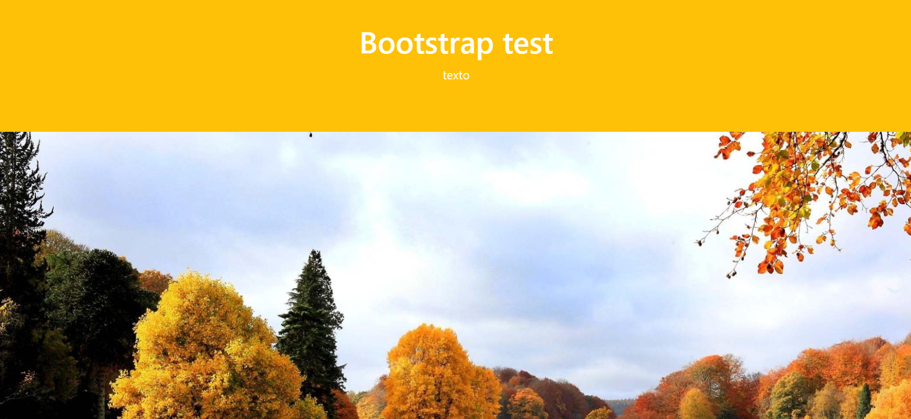

### Cuestionarios:
Este archivo HTML muestra un formulario con varios tipos de entradas, como texto, correo electrónico, número, opciones de radio, casillas de verificación, selecciones desplegables, y campos de fecha y hora, con estilos personalizados para botones de envío y efectos de hover.

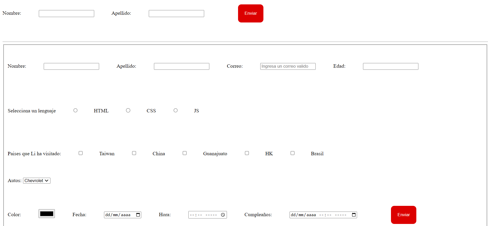

### Escritora Favorita:
Este archivo HTML presenta una página web sobre la escritora Joana Marcús, incluyendo su biografía, imágenes, información sobre sus libros publicados y enlaces a fuentes externas. Utiliza un archivo CSS externo para el estilo y fuentes personalizadas de Google Fonts.

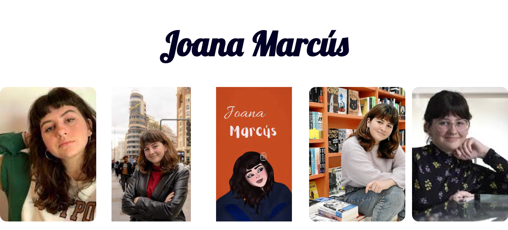

### Etiquetas:
Este archivo HTML demuestra el uso de tablas, listas, estilos en línea y externos, clases e identificadores CSS, así como la inserción de videos e iframes, para presentar información estructurada y estilizada, incluyendo una lista de ciudades y un mapa incrustado.

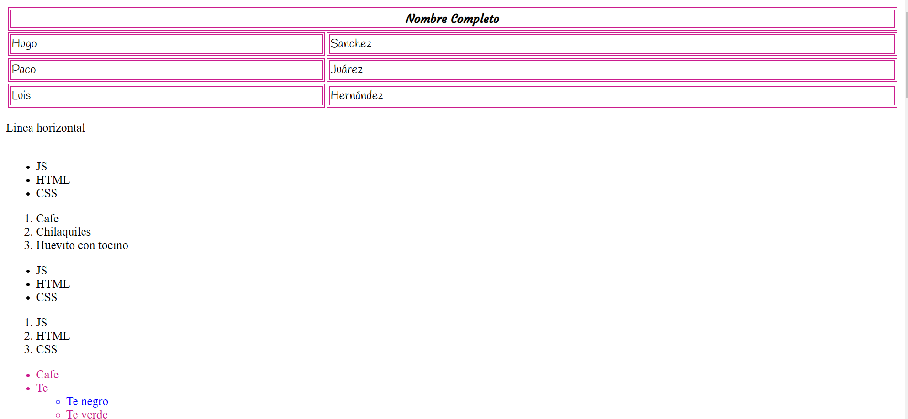

### Figuras Responsivas:
Este archivo HTML está diseñado para demostrar diversas animaciones y estilos aplicados a elementos div, utilizando clases e identificadores.

### Galería de Libros Responsiva:
Este archivo HTML crea una galería de fotos que muestra portadas de libros en un formato responsivo. Utiliza divisiones para organizar las imágenes en columnas y filas, con estilos y efectos de responsividad

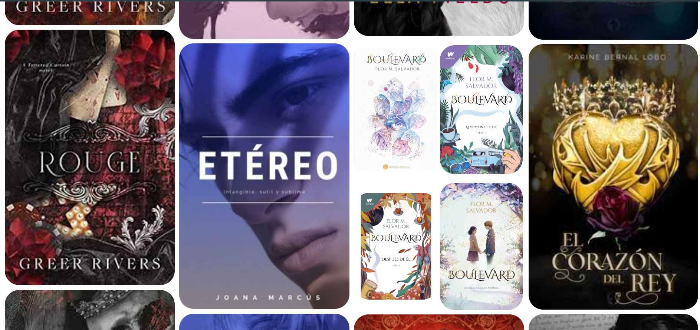

### Navegación:
Este archivo HTML crea una página web con un menú de navegación lateral fijo y secciones de contenido que se desplazan verticalmente. Cada sección tiene un fondo de imagen diferente y se utiliza CSS en línea para el estilo y la disposición. Se usan fuentes personalizadas de Google Fonts para estilizar el texto.

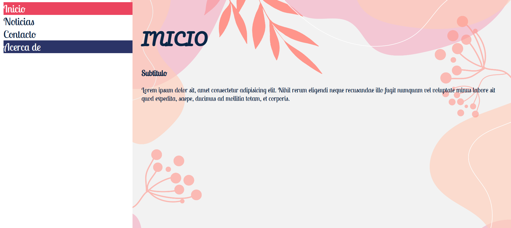

### Carrusel de Paisajes:
Este archivo HTML demuestra el uso de transiciones CSS aplicadas a una galería de imágenes y un botón. La galería presenta un efecto de expansión al pasar el ratón sobre las imágenes, mientras que el botón cambia de color cuando se interactúa con él. Las imágenes de la galería se configuran mediante clases que asignan diferentes URLs de fondo.

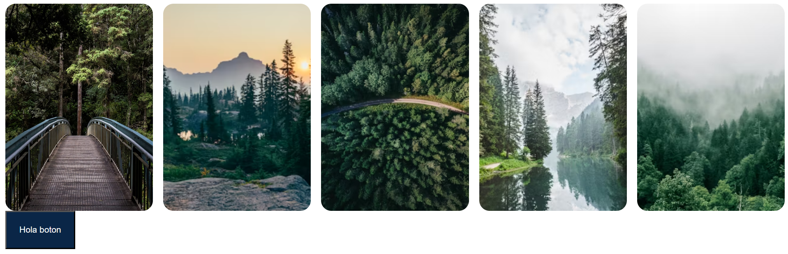

### Títulos:
Este archivo HTML es una página web básica que incluye enlaces de navegación, encabezados, párrafos, texto estilizado y una imagen. Utiliza Bootstrap para el estilo y la disposición, con estilos en línea para personalizar colores y tamaños. Incluye enlaces a otras páginas web y un script de Bootstrap para funcionalidad adicional.

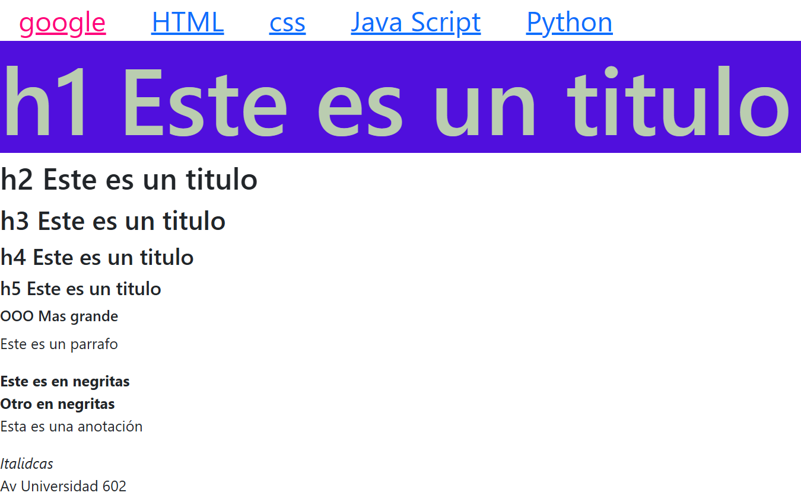

### App Libros:
Este archivo HTML crea una página web titulada "It's Book O'Clock". Incluye encabezados, imágenes (tanto desde internet como desde la computadora del usuario), listas ordenadas y desordenadas de libros y autores recomendados, y un enlace externo a un sitio web de libros recomendados. También conecta el archivo HTML con un archivo CSS externo para el estilo y utiliza fuentes personalizadas de Google Fonts.

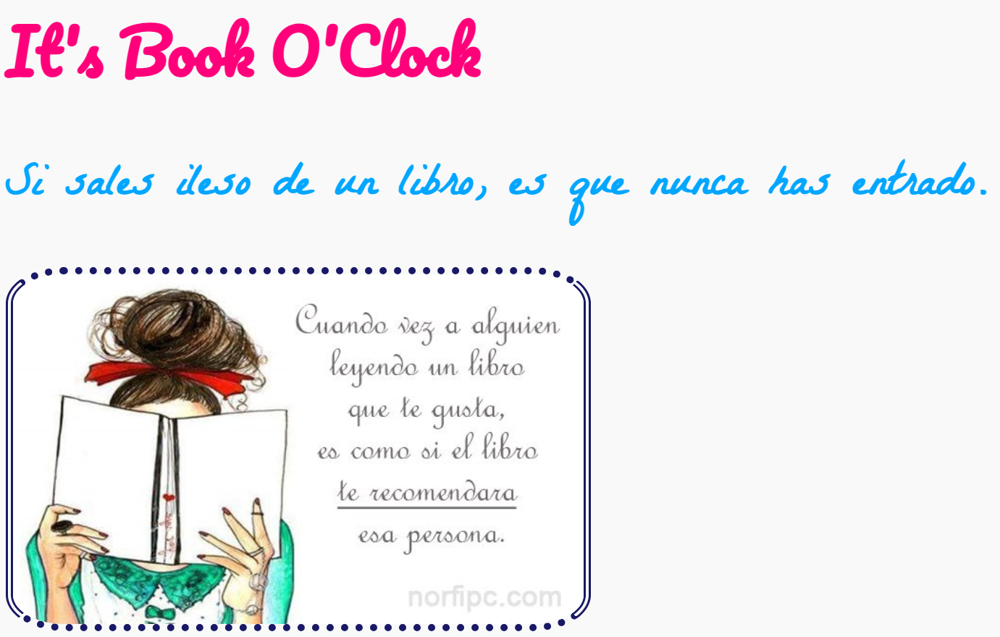
